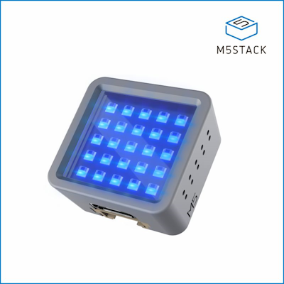

 <!-- .element class="hero" -->

alittlerusty.bowmanjd.com <!-- .element class="r-fit-text" -->
 <!-- .element style="vertical-align: middle" -->

---

## You might be a rustacean


---

## Rust is a programming language

```rust
fn main() {
    println!("Hello, world!");
}
```

---

I am writing something in Rust:

[github.com/bowmanjd/busser](https://github.com/bowmanjd/busser) <!-- .element: class="r-fit-text" -->

---

Commercial Break <!-- .element: class="r-fit-text" -->

---

## Markdown

[commonmark.org/help/tutorial/](https://commonmark.org/help/tutorial/)

```markdown
Use it in Teams, Jira, Zendesk, `GitHub`,
and **notes** to *your loved ones*!
```

Use it in Teams, Jira, Zendesk, `GitHub`, and **notes** to *your loved ones*!

I am exploring Obsidian, a note-taking framework ([obsidian.md](https://obsidian.md))

---


---

```sh
❯ busser --help
Usage: busser <command> [<args>]

Prepare tables for SQL Server

Options:
  --help            display usage information

Commands:
  output            Output special formats from CSV input
  columns           Show CSV columns
  schema            Get suggested SQL table schema
  view              View CSV file
```

---

## Sample CSV file

```csv
CustomerID,FirstName,LastName,StartDate  
12345,Fred,Flintstone,1960-09-30
67890,Lisa,Simpson,1989-12-17
```

---

```sh
❯ busser columns sample.csv
CustomerID, FirstName, LastName, StartDate
```

---

```sh
❯ busser view sample.csv
┌────────────┬───────────┬────────────┬────────────┐
│ CustomerID │ FirstName │ LastName   │ StartDate  │
├────────────┼───────────┼────────────┼────────────┤
│ 12345      │ Fred      │ Flintstone │ 1960-09-30 │
│ 67890      │ Lisa      │ Simpson    │ 1989-12-17 │
└────────────┴───────────┴────────────┴────────────┘
```

---

```sh
busser output -t Characters sample.csv
```

---

```txt
CustomerID\u{1f}FirstName\u{1f}LastName\u{1f}StartDate\u{1e}
12345\u{1f}Fred\u{1f}Flintstone\u{1f}1960-09-30\u{1e}
67890\u{1f}Lisa\u{1f}Simpson\u{1f}1989-12-17
```

---

```sh
bcp Characters in Characters.txt -c -t0x1f -r0x1e -d LegacyData -T -e character_errors.log
```

---

```sh
busser output -i -t Characters -j -o Characters.sql sample.csv
```

---

```sql
INSERT INTO Characters
SELECT
    CustomerID,
    FirstName,
    LastName,
    StartDate
FROM OPENJSON('[ \
    {"CustomerID": "12345", "FirstName": "Fred", "LastName": "Flintstone", "StartDate": "1960-09-30"}, \
    {"CustomerID": "67890", "FirstName": "Lisa", "LastName": "Simpson", "StartDate": "1989-12-17"} \
]') WITH (CustomerID VARCHAR(5), FirstName VARCHAR(4), LastName VARCHAR(10), StartDate VARCHAR(10));
```

---

Commercial Break <!-- .element: class="r-fit-text" -->

---

## The Atom Matrix by M5Stack

 <!-- .element: class="r-stretch" -->

A $15 hobby (or home automation) device, based on the ESP32 system-on-a-chip. [m5stack.com](https://m5stack.com) 

---


---

The most work (and the most compute) is involved in the schema inference. Feed a CSV file to `busser schema`, and out comes a CREATE TABLE statement for Microsoft SQL Server, with columns correctly (and quite conservatively, at this point) typed.

---

```sql
❯ busser schema -t Characters sample.csv
DROP TABLE IF EXISTS Characters;
CREATE TABLE Characters (CustomerID INT, FirstName CHAR(4), 
                         LastName VARCHAR(10), StartDate DATE);
```

---

## Why Rust?

- Something new and well designed
- Such hospitality!
- Great documentation: rust-lang.org/learn
- Memory safe, yet no garbage collector
- So. Fast.

---

<!-- .slide: data-background-image="assets/busser.gif"  -->

---

You should not use this tool.

_Not quite_ ready for primetime.

---

Yet you might consider learning something new!

Invigorating and humbling.

---

Commercial Break <!-- .element: class="r-fit-text" -->

---

## Home Assistant 

home-assistant.io


---


---
